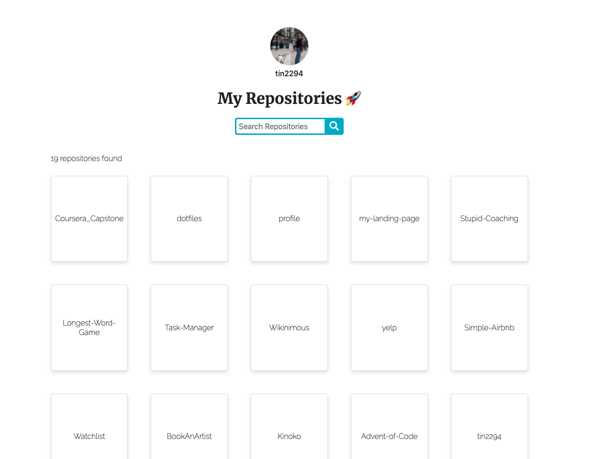

<div id="top"></div>


<!-- PROJECT LOGO -->
<br />
<div align="center">
  <a href="https://repository-search-ttchz.herokuapp.com/">
    
  </a>

  <h3 align="center">Search Repositories</h3>

  <p align="center">
    Easily view and search github user repositories by name.
    <br />
    <a href="https://github.com/tin2294/repository-search"><strong>Explore the docs »</strong></a>
    <br />
    <br />
    <a href="https://repository-search-ttchz.herokuapp.com/">View Demo</a>
  </p>
</div>


<!-- TABLE OF CONTENTS -->
<details>
  <summary>Table of Contents</summary>
  <ol>
    <li><a href="#about-the-project">About The Project</a></li>
    <li><a href="#usage">Usage</a></li>
    <li><a href="#testing">Test Suite</a></li>
    <li><a href="#future">Future Improvements</a></li>
  </ol>
</details>


<!-- ABOUT THE PROJECT -->
## About The Project



This app allows you to search through a list of repositories by their name. It will give you the results as you type and it shows the username and its picture.

Each card shows the name of each of the repositories in the list.

<p align="right">(<a href="#top">back to top</a>)</p>


<!-- USAGE EXAMPLES -->
## Usage

This project has been deployed on Heroku and can be accessed here:
<br>
<a href="https://repository-search-ttchz.herokuapp.com/">View Demo</a>
<br>

In order to run it locally:

1. Get a an API Token for GitHub [https://docs.github.com/es/authentication/keeping-your-account-and-data-secure/creating-a-personal-access-token](https://docs.github.com/es/authentication/keeping-your-account-and-data-secure/creating-a-personal-access-token)
2. Clone the repo
   ```sh
   git clone https://github.com/tin2294/repository-search
   ```
3. Install NPM packages
   ```sh
   npm install
   ```
4. Create a .env file to store your token in
   ```sh
   touch .env
   ```
5. Enter your API in `.env`
   ```js
   REACT_APP_GITHUB_PERSONAL_ACCESS_TOKEN='insert your token here';
   ```

Now you can run this project locally!


<p align="right">(<a href="#top">back to top</a>)</p>

## Test Suite

As of now and as a starting point for testing in this app, I implemented a test which is on the Search.js file where I just check for the text in the placeholder of the Search Bar.

In order to execute the tests, run this command on the terminal:
   ```sh
   npm test
   ```

<p align="right">(<a href="#top">back to top</a>)</p>


<!-- Future Improvements -->
## Future Improvements

- [X] Make repositories into cards
- [X] Responsiveness
- [X] Heroku Deployment
- [X] Add avatar and username
- [X] Add count of results
- [ ] Additional Heroku push with the latest updates (avatar and username, responsiveness and some styling) since the version that is up is not the current one from the repository as I encountered some technical issues that I finally had to open a ticket for.
- [ ] Add additional tests
- [ ] Refactor code
- [ ] Search Repositories and information through a username search bar


<p align="right">(<a href="#top">back to top</a>)</p>
